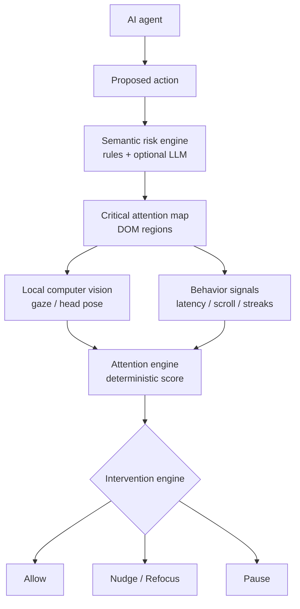

# OverSight

**Human approval shouldn't mean human autopilot.**
Proof that human oversight was actually human.

OverSight is an attention-aware safety layer for human approval of AI-agent actions. When an agent asks a person to sign off, OverSight identifies the few consequences that materially affect the decision, uses on-device computer vision and interaction signals to check whether those consequences were actually looked at, and adds friction only when the evidence says they were not. It then points to exactly what was missed, not to a generic "Are you sure?".

> OverSight does **not** claim to know whether someone understood an approval. It detects evidence that decision-critical information was probably **not visually inspected** before approval.

---

## The problem: approval fatigue

> Automated systems request human sign-off to prevent critical errors, yet the continuous volume of routine approvals trains human monitors to endorse every action without scrutiny.

Human-in-the-loop controls assume the human is reading. After the ninth routine request, the tenth, the one that permanently deletes 2,431 customer records, looks exactly like the others. The approval click is recorded; whether the consequence was ever seen is not. Adding more warnings makes it worse: when everything is flagged, nothing is.

## Why traditional human-in-the-loop breaks

| Common control | Failure mode under fatigue |
|---|---|
| "Are you sure?" confirmation | Becomes a second reflexive click |
| Mandatory wait timer | People wait, then click; time is not attention |
| Highlight every risk | Warning blindness; the critical line drowns in noise |
| Audit log of approvals | Proves a click happened, not that the consequence was seen |

## The solution: semantic attention verification

Traditional eye tracking asks: *"Where did the user look?"*
OverSight asks: ***"Did the user visually inspect the information that materially affects this decision?"***

1. **AI identifies what matters.** A semantic risk engine reads the proposed action and selects the decision-critical consequences (at most two; routine requests get one key detail).
2. **The UI knows where it is.** Every content block is rendered as a DOM element tagged `data-attention-region`. OverSight never OCRs the screen: it owns the DOM and knows exactly where the critical sentence is drawn.
3. **On-device CV measures attention.** MediaPipe Face Landmarker runs in the browser (WebAssembly). Iris position, eye-direction coefficients and head pose are mapped to screen coordinates by a quick 9-point calibration, then tested against the critical region's live bounding box.
4. **Behavior adds context.** Approval latency against the reviewer's *own* baseline, visibility, scroll depth, rapid-approval streaks, and the attention trend across the session.
5. **A deterministic safety engine decides.** Risk x attention evidence x critical coverage x behavioral anomaly selects one of four intervention levels. Routine approvals stay frictionless.
6. **Intervention is specific.** Instead of a generic popup, the approval pauses on the exact sentence that appears to have been skipped, and only re-enables once that sentence has actually been looked at (or manually acknowledged when the camera is not an option).

```
AI Action  ->  Semantic Risk  ->  Human Attention  ->  Intelligent Intervention
```

## Architecture

Four layers, each with one job. Full detail and diagrams: [docs/ARCHITECTURE.md](docs/ARCHITECTURE.md).



| Layer | Role | Where |
|---|---|---|
| **AI layer** | Understands what matters: risk, decision-critical consequences, plain-language statements | `lib/semantic/` |
| **Computer vision layer** | Measures where attention goes, on-device | `lib/cv/` |
| **Behavioral + ML layer** | Latency baseline, session pattern, trainable classifier | `lib/attention/pattern.ts`, `lib/attention/baseline.ts`, `lib/ml/` |
| **Deterministic safety engine** | Decides when intervention is required | `lib/attention/engine.ts`, `lib/risk/intervention.ts` |

### AI layer: semantic risk engine

- **Deterministic rule engine** (`lib/semantic/rules.ts`) with explainable rules: irreversible data deletion, public exposure of databases, recently changed and unverified payees, unmasked personal data leaving the organization, service outages, write access for external integrations, large funds transfers, lapsed agreements, credential revocation, production migrations. Includes negation handling ("No downtime expected").
- **Target selection** keeps attention targets few: highest severity present, one per risk category, preferring the plain-language consequence over a raw setting that expresses the same risk.
- **Optional OpenAI-compatible provider** (`lib/semantic/ai-provider.ts`), called server-side. Its output is merged on a **deterministic floor**: AI can escalate, never de-escalate; high-severity rule targets can never be dropped; AI field ids and phrases are validated against the real DOM content.
- Works fully offline with no API key. Seeded scenarios are still *analyzed* at runtime; their expected results are test oracles, not hard-coded answers.

### Computer vision layer

- `getUserMedia` (1280x720) -> MediaPipe Face Landmarker, GPU delegate with CPU fallback, up to two faces (a second face marks the signal unreliable).
- Features per frame (`lib/cv/features.ts`): iris position inside each eye's own coordinate frame (robust to head roll), eyelid aperture, eye-direction blendshape coefficients, head yaw/pitch/roll from the facial transformation matrix, face position.
- **Calibration** (`lib/cv/calibration.ts`): 9 targets, ~15 s, blink and outlier frames rejected, per-axis ridge regression with lambda chosen by **leave-one-point-out** cross-validation. The same validation reports quality as *Good / Fair / Recalibration recommended*, never a fake precision number.
- **Smoothing and fixations:** One Euro filter; dispersion-based fixation detection with a threshold sized to the measured calibration error.
- **Region mapping** (`lib/attention/tracker.ts`): gaze is tested against the live bounding boxes of registered regions, expanded by a margin derived from calibration error. Time is only counted while a region is actually visible on screen.
- **Implicit drift correction:** clicking a decision control nudges the estimate toward it (people look at what they click), gated and capped.

### Behavioral + ML layer

- **Personal baseline** (`lib/attention/baseline.ts`): review pace (ms per decision-relevant word) and critical-region dwell from the first attentive reviews; frozen after three so later rubber-stamping cannot drag it down. Robust defaults before that.
- **Session pattern** (`lib/attention/pattern.ts`): declining attention across consecutive approvals, rapid-approval streaks, latency trend. When detected, OverSight reports an **approval fatigue pattern**, raises intervention sensitivity, and can switch to **critical-only review mode**. This is a behavioral pattern in the interaction, never a claim that someone is tired.
- **Trainable classifier** (`lib/ml/`): L2 logistic regression (Newton/IRLS) with stratified cross-validation, trained on reviews you label yourself in the Model lab or via `npm run train`. It **ships untrained** (no public dataset exists; none is invented). It only activates after validation (>= 8 examples per label, CV AUC >= 0.70), and even then it is advisory: it can raise sensitivity, never lower it.

### Deterministic safety engine

Attention score (gaze available):

| Component | Weight | Meaning |
|---|---|---|
| Critical-region coverage | 35% | Gaze dwell on decision-critical regions vs. required dwell |
| Reading evidence | 15% | Horizontal sweep across the sentence + fixations on it |
| Review time | 15% | Latency vs. the personal (or default) expected review time |
| Visibility | 10% | Time the critical regions were actually on screen |
| Presence | 10% | One face, oriented to the screen |
| Session pattern | 15% | Inverse of the repeated low-attention pattern strength |

Without reliable gaze (camera off, face lost, multiple faces, not calibrated), the engine switches to behavioral weights (latency 40%, visibility 20%, interaction 10%, pattern 30%) and reports low confidence. It never counts a missing face as "not reading".

Interventions (thresholds scale with a sensitivity multiplier that grows with the session pattern, capped at 1.5x):

| Risk | Pause (Level 3) | Refocus (Level 2) | Nudge (Level 1) |
|---|---|---|---|
| **Critical** | critical coverage < 25% | coverage < 60% or score < 45% | score < 60% |
| **High** | coverage < 15% and (anomaly or score < 35%) | coverage < 45% or score < 40% | score < 55% |
| **Medium** | never | near-zero coverage + low score + anomaly | score < 50% or coverage < 30% |
| **Low** | never | never | only inside a detected pattern |

Every threshold and weight lives in `lib/attention/config.ts` and `lib/risk/intervention.ts`. See [docs/TUNING.md](docs/TUNING.md).

## Privacy architecture

**Video never leaves this device. We monitor the approval interaction, not the employee.**

- Camera frames are processed in the browser tab and immediately reduced to a few numbers; nothing is recorded, stored or uploaded.
- The Content-Security-Policy sets `connect-src 'self'`: the page can only talk to its own origin.
- The MediaPipe runtime and model are served from this origin (no CDN while the camera is on).
- No facial recognition, identity, age, gender, ethnicity or emotion inference. Only eye-direction and blink coefficients are read from the face model.
- Stored: derived numbers only, in this browser session. A camera-free mode with manual acknowledgement is always available.

Full statement: [docs/PRIVACY.md](docs/PRIVACY.md).

## What OverSight does NOT claim

- It does not know whether you **understood** a request. Looking is evidence of inspection, not comprehension.
- It does not infer **fatigue, stress** or any psychological state. "Approval fatigue pattern" describes declining review behavior.
- It is **not medical-grade or research-grade eye tracking.** Commodity webcam gaze is approximate (often 100 to 200 px), which is why attention is evaluated on whole regions.
- It does not **identify or profile** anyone.
- It reports **no accuracy figure** it has not measured. The only model metrics shown are cross-validation results on your own labeled data.

This narrower claim is the one the system can actually support, and that is the point.

## Demo

The 90 to 120 second judging script, with speaking cues and a pre-flight checklist: **[docs/DEMO.md](docs/DEMO.md)**.

Short version: calibrate -> approve two routine requests properly -> speed up on the next two -> on "Deploy Database Configuration" look only at the title and click Approve -> OverSight pauses on "2,431 customer records will be permanently deleted." with a heatmap proving the warning was skipped -> read it -> confirm -> end on the attention trend.

Demo controls (they only navigate or reset; they can never create attention evidence): `N` next, `R` reset, `O` attention overlay, `D` diagnostics, `C` calibration, `S` session analytics, `?` help.

## Local setup

Requirements: **Node.js 20.9+** (tested on 22), a Chromium-based browser (Chrome or Edge recommended), a webcam.

```bash
npm install          # also copies the MediaPipe WASM runtime and downloads the face model (3.8 MB, once)
npm run demo         # production build + start on http://localhost:3000
```

Development server: `npm run dev`. If the model download was blocked during install, run `npm run setup:assets` once you are online.

Camera access requires a secure context: `http://localhost` works; for another machine on the network, use HTTPS.

## Environment variables

None are required. Copy `.env.example` to `.env.local` to enable the optional AI provider:

| Variable | Default | Purpose |
|---|---|---|
| `OVERSIGHT_AI_API_KEY` (or `OPENAI_API_KEY`) | unset | Enables the OpenAI-compatible semantic analyzer |
| `OVERSIGHT_AI_BASE_URL` (or `OPENAI_BASE_URL`) | `https://api.openai.com/v1` | Any OpenAI-compatible endpoint (vLLM, Ollama, OpenRouter...) |
| `OVERSIGHT_AI_MODEL` | `gpt-4o-mini` | Model name |
| `OVERSIGHT_AI_TIMEOUT_MS` | `12000` | Falls back to the rule engine on timeout or error |

Only approval-request **text** is ever sent to the provider, server-side. For judging, leaving it unset gives fully deterministic behavior.

## Testing

```bash
npm run test         # Vitest unit suite
npm run typecheck    # tsc --noEmit
npm run lint         # ESLint (Next.js core-web-vitals + TypeScript)
npm run build        # production build
npm run check        # typecheck + lint + test
```

The suite covers the semantic risk engine against every seeded scenario (risk, targets, plain-language statements, phrase integrity), the AI merge floor, custom-text parsing, the attention engine (high risk + low attention -> pause; high risk + good attention -> allow; low risk + low attention -> no excessive intervention; face unavailable -> behavioral fallback; critical region not visible -> gaze not penalized; rapid streak -> anomaly and sensitivity increase), intervention thresholds, the session pattern, region geometry, re-review validation (successful re-review enables approval; time alone does not), calibration regression and leave-one-point-out quality, head pose, One Euro filtering, fixation detection, logistic regression, and an end-to-end simulation of the judging demo.

## Project structure

```
app/                      routes: landing, /setup, /console, /session, /lab, /how-it-works, /api/analyze, /api/classifier
components/
  approval/               approval card, decision bar, pause view, queue, composer, manual acknowledgement
  attention/              intelligence panel, overlay, evidence map, gaze cursor, diagnostics
  calibration/            permission flow, camera preview, calibration runner, gaze check
  dashboard/              session analytics, model lab
  layout/ ui/ brand/ providers/
lib/
  semantic/               rule engine, parser, AI provider, merge, API client
  cv/                     camera engine (MediaPipe), features, head pose, calibration, filters, gaze hub
  attention/              region registry, tracker, engine, baseline, pattern, re-review, config
  risk/                   intervention engine, risk labels
  ml/                     features, logistic regression, dataset
  store/                  zustand stores (session, cv, live, ui)
data/scenarios/           seeded AI-agent approval requests (+ test oracles)
scripts/                  setup-assets.mjs, train-attention-model.ts
tests/                    Vitest suite
docs/                     ARCHITECTURE, PRIVACY, DEMO, TUNING
```

## Limitations

- Webcam gaze accuracy depends on lighting, camera position, glasses and head movement. Calibration quality is measured and shown; recalibrate when it drops, when you move, or when the window is resized.
- A calibration belongs to one browser tab and one window size.
- Dwell on a region is evidence of inspection, not of reading every word or understanding.
- The rule engine covers common high-risk patterns in English; novel phrasing may need the optional AI layer.
- The behavioral classifier needs your own labeled sessions; labels collected in the Model lab are instructed conditions (weak supervision).
- Single-user, single-machine prototype: no accounts, no server-side persistence.

## Future work

- Per-user calibration refinement from ongoing implicit anchors (clicks, scroll targets) with drift monitoring.
- Integrations: approval hooks for agent frameworks, CI/CD deploy gates, finance approval flows, chat-ops.
- Organization-level, privacy-preserving aggregates (for example "critical approvals paused per week") without per-person profiles.
- A labeled, consented evaluation study to measure real intervention precision and recall.
- Multilingual semantic rules; screen-reader-first review verification.
