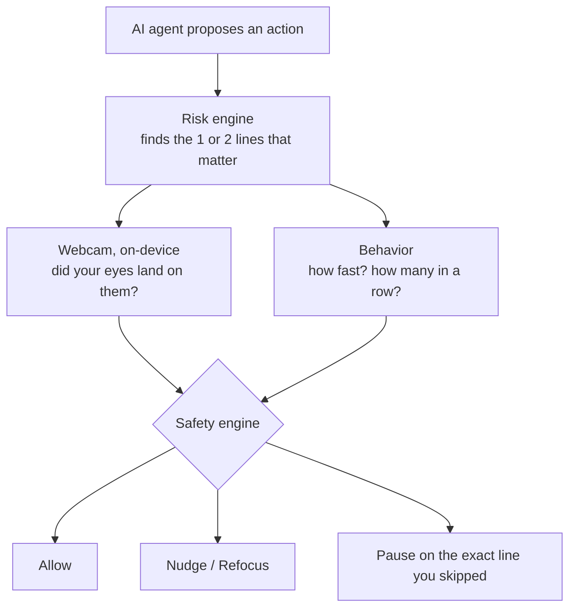

<div align="center">

# OverSight

**Human approval shouldn't mean human autopilot.**

AI agents ask humans to approve their actions. After the tenth routine request, humans stop reading and just click **Approve**.<br>
OverSight checks whether you actually *looked at* the part that matters, and only steps in when you didn't.


</div>

---

## TL;DR

> **Me:** *approves 4 routine requests in a row, feeling productive*\
> **Request #5:** *"btw this permanently deletes 2,431 customer records"*\
> **Me:** *approves without reading it*\
> **OverSight:** hold up.

OverSight is a safety layer for the approval screen that AI agents show humans. It does three things:

1. **Finds what matters.** It reads the request and picks the one or two sentences that actually change the decision, like *"2,431 customer records will be permanently deleted."*
2. **Checks if you looked.** It uses your webcam, processed **entirely inside your browser**, to estimate whether your eyes actually landed on those sentences.
3. **Steps in only when it counts.** Skipped the scary line on a risky request? The approval pauses on **that exact sentence** until you've looked at it. Routine stuff stays zero-friction.

> [!NOTE]
> OverSight does **not** claim to know whether you *understood* something. It detects evidence that decision-critical info was probably **not looked at** before you approved. Smaller claim, but one it can actually back up.

## The problem: approval fatigue

Making AI agents ask a human before doing risky stuff sounds great. In practice, it goes like this:

| # | The request | What you did |
|:-:|---|---|
| 1 | Regenerate weekly analytics report | Read it, approved |
| 2 | Deploy a dependency patch | Read it, approved |
| 3 | Renew a TLS certificate | Skimmed it, approved |
| 4 | Scale down idle preview environments | Vibes-based approval |
| 5 | Deploy Database Configuration | Read the title, approved |

Request #5 had one line buried in it: **2,431 customer records will be permanently deleted.** It looked exactly like the four before it.

The audit log says *"approved by a human."* Technically true. But whether anyone actually *saw* the consequence was never recorded. That's **approval fatigue**: after enough routine requests, the Approve click becomes a reflex.

### Why the usual fixes flop

| The classic fix | What actually happens |
|---|---|
| "Are you sure?" popup | Congrats, you now have two Approve buttons |
| "Wait 5 seconds" timer | People wait 5 seconds, then click. Time ≠ attention. |
| Highlight every risk in red | When everything is red, nothing stands out |
| Audit log of approvals | Proves a click happened, not that anyone saw the consequence |

OverSight's take: don't add friction to *everything*. Add it to **the one thing you skipped**, and **only when you skipped it**.

## How it works



1. **AI finds the lines that actually matter (the main characters).** A risk engine reads the request and picks the decision-critical consequences: at most two, and just one "key detail" for routine requests. Flag everything and you're back to warning blindness.
2. **The UI knows exactly where they are.** OverSight draws the approval card itself, so every chunk of text is a tagged element on the page and it knows the exact on-screen box of the critical sentence. No screenshots, no OCR.
3. **Your webcam checks where your eyes went.** A face-tracking model (MediaPipe Face Landmarker) runs inside your browser. After a quick ~15 second calibration (follow 9 dots with your eyes), it turns iris position and head pose into a rough "you're looking here" point and checks it against that box.
4. **Behavior adds context.** How fast did you approve compared to *your own* normal pace? Is this your third speedrun in a row? Is your attention trending down across the session?
5. **A rule-based engine makes the call.** Not a black box: how risky it is × where you looked × how long you looked at the critical lines × how unusual your pace was → one of four levels.
6. **The intervention is specific.** No generic "Are you sure?". It shows you the exact sentence you skipped and unlocks once you've actually looked at it (or typed an acknowledgement, if you're not using the camera).

### The four levels

| Level | What you see | Typically when |
|---|---|---|
| **0 · Normal** | Nothing. Approved. | You looked at what matters, or it's low risk |
| **1 · Nudge** | A subtle highlight; the approval still goes through | Your attention was a bit mid |
| **2 · Refocus** | Approve turns into **Review critical consequence →** | You skimmed past something high-risk, or it never made it onto your screen |
| **3 · Pause** | **APPROVAL PAUSED**, showing the exact line you skipped | High or critical risk, and the critical line got basically none of your attention |

Low- and medium-risk requests never get paused. And **Reject is never blocked**: saying no is always free.

## The demo (aka getting caught in 720p)

1. **Calibrate.** Follow 9 dots with your eyes (~15 s).
2. **Approve two routine requests properly.** Read the *Key detail*, approve. Zero friction. OverSight understood the assignment.
3. **Speed up on the next two.** Glance, approve. They're low risk so it lets them slide, but it notices your attention trend dropping.
4. **Request #5, "Deploy Database Configuration."** Look *only* at the title and click Approve within about a second.
5. **APPROVAL PAUSED.** It stops on *"2,431 customer records will be permanently deleted."* next to a heatmap of where your eyes actually went: all over the title, ~0% on the warning. Tell me you didn't read it without telling me you didn't read it.
6. **Actually read the sentence.** The progress bar fills after a second or two of looking, then click **I reviewed the critical consequence**.
7. **Press `S`** to see your attention dropping across the session: the *approval fatigue pattern*.

Full 90 to 120 second script with speaking cues and a pre-flight checklist: **[docs/DEMO.md](docs/DEMO.md)**.

**Keyboard shortcuts** (in the console):

| Key | Does |
|:-:|---|
| `N` | Next request (skip) |
| `R` | Reset the session (keeps calibration) |
| `O` | Toggle the attention overlay |
| `D` | Toggle diagnostics (the nerd panel) |
| `C` | Camera & calibration |
| `S` | Session analytics |
| `?` | Show shortcuts |

These only navigate or reset. They **can't** create attention evidence, so no cheat codes.

## Privacy (aka "wait, a webcam is watching me??")

Valid question. Short answer: **video never leaves your device. We monitor the approval interaction, not the employee.** This isn't bossware; it's a seatbelt for the Approve button.

- **Frames never leave the tab.** Camera frames are processed inside your browser and instantly boiled down to a few numbers (iris position, head angle, that kind of thing). Nothing is recorded, stored, or uploaded. *("Caught in 720p" is a figure of speech, respectfully. Each frame is gone the moment it's been turned into numbers.)*
- **Enforced, not just promised.** The page ships a Content-Security-Policy of `connect-src 'self'`, so it can only talk to its own origin. Even a bug couldn't send camera data to a third party. Open DevTools → Network and check for yourself.
- **No CDN while the camera is on.** The MediaPipe runtime and face model are served from the app itself.
- **No face recognition, no profiling.** No identity, age, gender, ethnicity or emotion inference. It only reads the eye-direction and blink signals from the face model and ignores the rest.
- **Only derived numbers are stored**, and only in your browser.
- **Don't want to use the camera? Totally valid.** A camera-free mode with manual acknowledgement is always available.

Full breakdown of what's stored, where, and for how long: [docs/PRIVACY.md](docs/PRIVACY.md).

## What OverSight does NOT claim (no cap)

- It doesn't know whether you **understood** a request. Looking is evidence of inspection, not comprehension.
- It doesn't detect **fatigue, stress**, or any mood. "Approval fatigue pattern" means your *review behavior* got sloppier over the session. It's not reading your vibes.
- It's **not medical- or research-grade eye tracking.** Webcam gaze is approximate (often 100 to 200 px off), which is exactly why it checks whole regions of text, not individual words.
- It doesn't **identify or profile** anyone.
- It reports **no accuracy number it hasn't measured.** The only model metrics shown are cross-validation results on *your own* labeled data.

This narrower claim is the one the system can actually support, and that's the point.

## Run it yourself

**You need:** Node.js 20.9+ (tested on 22), a Chromium browser (Chrome or Edge), and a webcam (optional thanks to the camera-free mode, but that's where the magic is).

```bash
npm install          # also copies the MediaPipe WASM runtime + downloads the face model (3.8 MB, once)
npm run demo         # production build + start on http://localhost:3000
```

Open **http://localhost:3000** and you're in. No API keys, no accounts, no config.

- **Hot reload:** `npm run dev`.
- **Face model download blocked during install?** Run `npm run setup:assets` once you're online.
- **Camera needs a secure context:** `http://localhost` works. To use it from another machine on your network, you'll need HTTPS.

### What's in the app

| Page | What it's for |
|---|---|
| `/` | Landing page |
| `/setup` | Camera permission, 9-dot calibration, gaze check |
| `/console` | The approval console, where the demo happens |
| `/session` | Session analytics: your attention trend across approvals |
| `/lab` | Model lab: label your own reviews and train the optional classifier |
| `/how-it-works` | The in-app explainer |

## Optional: plug in an LLM

Nothing is required. By default OverSight uses a deterministic rule engine and works **fully offline**. Want an LLM helping spot risks too? Copy `.env.example` to `.env.local`:

| Variable | Default | Purpose |
|---|---|---|
| `OVERSIGHT_AI_API_KEY` (or `OPENAI_API_KEY`) | unset | Turns on the OpenAI-compatible semantic analyzer |
| `OVERSIGHT_AI_BASE_URL` (or `OPENAI_BASE_URL`) | `https://api.openai.com/v1` | Any OpenAI-compatible endpoint (vLLM, Ollama, OpenRouter...) |
| `OVERSIGHT_AI_MODEL` | `gpt-4o-mini` | Model name |
| `OVERSIGHT_AI_TIMEOUT_MS` | `12000` | Falls back to the rule engine on timeout or error |

Ground rules for the AI:

- Only approval-request **text** is ever sent to it, server-side. Camera data never exists on the server.
- The AI can make OverSight *more* paranoid, never more chill: it can escalate risk but never downgrade it, and it can't drop high-severity targets the rules found.
- For judging, leave it unset for fully deterministic behavior.

## Tests

```bash
npm run test         # Vitest unit suite
npm run typecheck    # tsc --noEmit
npm run lint         # ESLint (Next.js core-web-vitals + TypeScript)
npm run build        # production build
npm run check        # typecheck + lint + test in one go
```

The suite pins down the behavior that matters:

- High risk + didn't look → **pause**
- High risk + did look → **allow**
- Low risk + didn't look → **no drama** (no excessive intervention)
- Face not visible → falls back to behavioral signals (a missing face never counts as "not reading")
- Critical line not on screen → gaze isn't penalized
- Rapid-approval streak → anomaly flagged, sensitivity goes up
- Re-review → actually looking unlocks approval; just waiting it out doesn't

…plus the semantic risk engine against every seeded scenario (risk, targets, plain-language statements, phrase integrity), the AI merge floor, custom-text parsing, intervention thresholds, the session pattern, region geometry, calibration regression and leave-one-point-out quality, head pose, One Euro filtering, fixation detection, logistic regression, and an end-to-end simulation of the judging demo.

## Deep dive (for the nerds)

Four layers, each with one job: **AI decides what matters, computer vision measures where attention went, behavior adds context, and a deterministic engine decides whether to intervene.** Full detail and more diagrams in [docs/ARCHITECTURE.md](docs/ARCHITECTURE.md); every tunable knob is explained in [docs/TUNING.md](docs/TUNING.md).

| Layer | Role | Where |
|---|---|---|
| **AI layer** | Understands what matters: risk, decision-critical consequences, plain-language statements | `lib/semantic/` |
| **Computer vision layer** | Measures where attention goes, on-device | `lib/cv/` |
| **Behavioral + ML layer** | Latency baseline, session pattern, trainable classifier | `lib/attention/pattern.ts`, `lib/attention/baseline.ts`, `lib/ml/` |
| **Deterministic safety engine** | Decides when intervention is required | `lib/attention/engine.ts`, `lib/risk/intervention.ts` |

<details>
<summary><b>AI layer: semantic risk engine</b></summary>

- **Deterministic rule engine** (`lib/semantic/rules.ts`) with explainable rules: irreversible data deletion, public exposure of databases, recently changed and unverified payees, unmasked personal data leaving the organization, service outages, write access for external integrations, large funds transfers, lapsed agreements, credential revocation, production migrations. Includes negation handling ("No downtime expected").
- **Target selection** keeps attention targets few: highest severity present, one per risk category, preferring the plain-language consequence over a raw setting that expresses the same risk.
- **Optional OpenAI-compatible provider** (`lib/semantic/ai-provider.ts`), called server-side. Its output is merged on a **deterministic floor**: AI can escalate, never de-escalate; high-severity rule targets can never be dropped; AI field ids and phrases are validated against the real DOM content.
- Works fully offline with no API key. Seeded scenarios are still *analyzed* at runtime; their expected results are test oracles, not hard-coded answers.

</details>

<details>
<summary><b>Computer vision layer</b></summary>

- `getUserMedia` (1280x720) → MediaPipe Face Landmarker, GPU delegate with CPU fallback, up to two faces (a second face marks the signal unreliable).
- **Features per frame** (`lib/cv/features.ts`): iris position inside each eye's own coordinate frame (robust to head roll), eyelid aperture, eye-direction blendshape coefficients, head yaw/pitch/roll from the facial transformation matrix, face position.
- **Calibration** (`lib/cv/calibration.ts`): 9 targets, ~15 s, blink and outlier frames rejected, per-axis ridge regression with lambda chosen by **leave-one-point-out** cross-validation. The same validation reports quality as *Good / Fair / Recalibration recommended*, never a fake precision number.
- **Smoothing and fixations:** One Euro filter; dispersion-based fixation detection with a threshold sized to the measured calibration error.
- **Region mapping** (`lib/attention/tracker.ts`): gaze is tested against the live bounding boxes of registered regions, expanded by a margin derived from calibration error. Time is only counted while a region is actually visible on screen.
- **Implicit drift correction:** clicking a decision control nudges the estimate toward it (people look at what they click), gated and capped.

</details>

<details>
<summary><b>Behavioral + ML layer</b></summary>

- **Personal baseline** (`lib/attention/baseline.ts`): review pace (ms per decision-relevant word) and critical-region dwell from the first attentive reviews; frozen after three so later rubber-stamping can't drag it down. Robust defaults before that.
- **Session pattern** (`lib/attention/pattern.ts`): declining attention across consecutive approvals, rapid-approval streaks, latency trend. When detected, OverSight reports an **approval fatigue pattern**, raises intervention sensitivity, and can switch to **critical-only review mode**. This is a behavioral pattern in the interaction, never a claim that someone is tired.
- **Trainable classifier** (`lib/ml/`): L2 logistic regression (Newton/IRLS) with stratified cross-validation, trained on reviews you label yourself in the Model lab or via `npm run train`. It **ships untrained** (no public dataset exists, and none is invented). It only activates after validation (≥ 8 examples per label, CV AUC ≥ 0.70), and even then it's advisory: it can raise sensitivity, never lower it.

</details>

<details>
<summary><b>Deterministic safety engine: weights and thresholds</b></summary>

**Attention score** (gaze available):

| Component | Weight | Meaning |
|---|---|---|
| Critical-region coverage | 35% | Gaze dwell on decision-critical regions vs. required dwell |
| Reading evidence | 15% | Horizontal sweep across the sentence + fixations on it |
| Review time | 15% | Latency vs. the personal (or default) expected review time |
| Visibility | 10% | Time the critical regions were actually on screen |
| Presence | 10% | One face, oriented to the screen |
| Session pattern | 15% | Inverse of the repeated low-attention pattern strength |

Without reliable gaze (camera off, face lost, multiple faces, not calibrated), the engine switches to behavioral weights (latency 40%, visibility 20%, interaction 10%, pattern 30%) and reports low confidence. It never counts a missing face as "not reading".

**Interventions** (thresholds scale with a sensitivity multiplier that grows with the session pattern, capped at 1.5×):

| Risk | Pause (Level 3) | Refocus (Level 2) | Nudge (Level 1) |
|---|---|---|---|
| **Critical** | critical coverage < 25% | coverage < 60% or score < 45% | score < 60% |
| **High** | coverage < 15% and (anomaly or score < 35%) | coverage < 45% or score < 40% | score < 55% |
| **Medium** | never | near-zero coverage + low score + anomaly | score < 50% or coverage < 30% |
| **Low** | never | never | only inside a detected pattern |

Every threshold and weight lives in `lib/attention/config.ts` and `lib/risk/intervention.ts`. See [docs/TUNING.md](docs/TUNING.md).

</details>

<details>
<summary><b>Project structure</b></summary>

```
app/                      routes: landing, /setup, /console, /session, /lab, /how-it-works, /api/analyze, /api/classifier
components/
  approval/               approval card, decision bar, pause view, queue, composer, manual acknowledgement
  attention/              intelligence panel, overlay, evidence map, gaze cursor, diagnostics
  calibration/            permission flow, camera preview, calibration runner, gaze check
  dashboard/              session analytics, model lab
  layout/ ui/ brand/ providers/
lib/
  semantic/               rule engine, parser, AI provider, merge, API client
  cv/                     camera engine (MediaPipe), features, head pose, calibration, filters, gaze hub
  attention/              region registry, tracker, engine, baseline, pattern, re-review, config
  risk/                   intervention engine, risk labels
  ml/                     features, logistic regression, dataset
  store/                  zustand stores (session, cv, live, ui)
data/scenarios/           seeded AI-agent approval requests (+ test oracles)
scripts/                  setup-assets.mjs, train-attention-model.ts
tests/                    Vitest suite
docs/                     ARCHITECTURE, PRIVACY, DEMO, TUNING
```

</details>

## Known limitations (keeping it real)

- Webcam gaze accuracy depends on lighting, camera position, glasses and head movement. Calibration quality is measured and shown; recalibrate when it drops, when you move, or when you resize the window.
- A calibration belongs to one browser tab and one window size.
- Looking at a region is evidence of inspection, not of reading every word or understanding it.
- The rule engine covers common high-risk patterns in English; creative phrasing may need the optional AI layer.
- The behavioral classifier needs your own labeled sessions; labels collected in the Model lab are instructed conditions (weak supervision).
- Single-user, single-machine prototype: no accounts, no server-side persistence.

## What's next

- Per-user calibration refinement from ongoing implicit anchors (clicks, scroll targets) with drift monitoring.
- Integrations: approval hooks for agent frameworks, CI/CD deploy gates, finance approval flows, chat-ops.
- Organization-level, privacy-preserving aggregates (for example "critical approvals paused per week") without per-person profiles.
- A labeled, consented evaluation study to measure real intervention precision and recall.
- Multilingual semantic rules; screen-reader-first review verification.

## Credits

- **Typeface:** [Satoshi](https://www.fontshare.com/fonts/satoshi) by Indian Type Foundry, via Fontshare, self-hosted in `app/fonts/`.
- **Look and feel:** the warm editorial palette, silver accent and chrome effects are adapted from the Cue / Xpand UI design pack.

---

<div align="center">

**Human approval shouldn't mean human autopilot.**<br>
<sub>Proof that human oversight was actually human.</sub>

</div>
