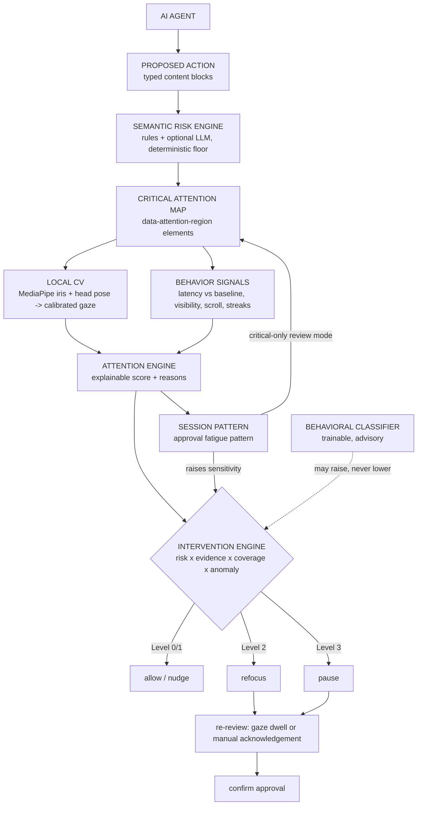
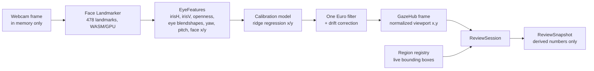
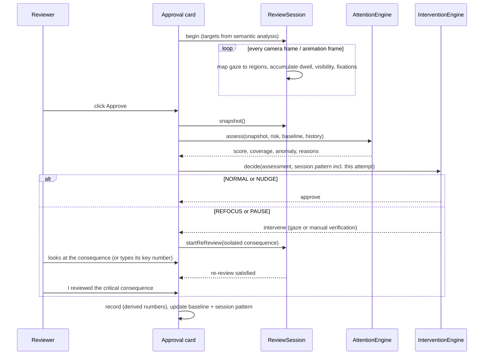
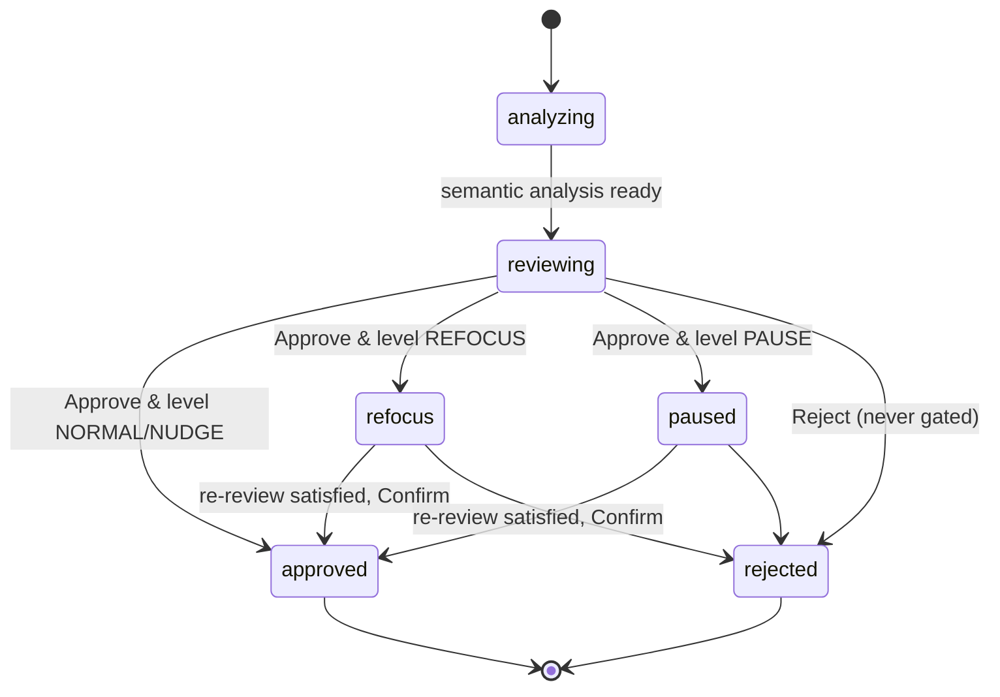

# Architecture

OverSight is a single Next.js application. Everything that touches the camera runs in the browser; the only server code is a text-only semantic analysis endpoint. The design goal: **AI decides what matters, computer vision measures where attention went, behavior adds context, and a deterministic engine decides whether to intervene.**

## System overview

## Layers and modules

| Layer | Module | Responsibility |
|---|---|---|
| Semantic (AI) | `lib/semantic/rules.ts` | Deterministic rules, block severity, target selection, statements |
| | `lib/semantic/analyzer.ts` | AI output schema, merge with deterministic floor, prompt |
| | `lib/semantic/ai-provider.ts` | OpenAI-compatible chat-completions call (server-side) |
| | `lib/semantic/server.ts`, `app/api/analyze/route.ts` | Rules always; AI when configured; fallback on error |
| | `lib/semantic/parser.ts` | Free text -> typed blocks for custom requests |
| Computer vision | `lib/cv/camera-engine.ts` | `getUserMedia`, MediaPipe Face Landmarker, frame loop |
| | `lib/cv/features.ts`, `lib/cv/head-pose.ts` | Landmarks -> iris ratios, eyelid aperture, eye blendshapes, yaw/pitch |
| | `lib/cv/calibration.ts` | Ridge regression per axis, leave-one-point-out validation, quality |
| | `lib/cv/one-euro.ts`, `lib/cv/fixation.ts` | Smoothing, fixation detection |
| | `lib/cv/gaze-hub.ts` | Single gaze source (camera or labeled simulation), calibration persistence, drift correction |
| Attention | `lib/attention/registry.ts` | DOM elements of semantic regions |
| | `lib/attention/tracker.ts` | Per-request measurement: dwell, visibility, sweep, fixations, pointer, scroll |
| | `lib/attention/engine.ts` | Deterministic attention score, confidence, reasons |
| | `lib/attention/baseline.ts` | Personal review pace and dwell |
| | `lib/attention/pattern.ts` | Session approval pattern ("approval fatigue", behavioral) |
| | `lib/attention/rereview.ts` | Re-review validation and manual acknowledgement |
| Decision | `lib/risk/intervention.ts` | Four-level intervention thresholds and sensitivity |
| ML | `lib/ml/features.ts`, `lib/ml/logistic.ts`, `lib/ml/dataset.ts` | Feature vector, IRLS logistic regression, cross-validation, local dataset |
| State | `lib/store/*.ts` | Zustand stores: session state machine, CV status, live metrics, UI prefs |

## Gaze pipeline

- Frames are processed with `requestVideoFrameCallback` (one inference per camera frame). The frame itself never leaves the landmarker call.
- Blink frames hold the last estimate for up to 350 ms rather than producing a spurious jump.
- If more than one face is present in more than 20% of frames, gaze evidence is marked unreliable for that review.
- The hit margin around each region is `clamp(0.6 x calibration error, 16, 72) px`, so reading a sentence counts even with webcam noise, while the title (hundreds of pixels away) does not.
- Regions are registered per request (`scope` = request id) and measurement starts only once that request's own card is mounted, so the outgoing card's identically named blocks can never count toward the next review.
- Dwell starts counting 500 ms after a request appears (where the eyes happened to rest is not inspection), and geometry/visibility also update from camera frames if animation frames are throttled.

## An approval attempt

## Approval state machine

## Scoring details

**Required dwell** per target: `words x msPerWord`, clamped to 0.6 to 2.4 s. `msPerWord` is 90 ms by default and becomes 60% of the reviewer's own attentive dwell once a baseline exists (clamped 50 to 160 ms).

**Expected review time**: decision-relevant words (title + summary + targets) x personal ms-per-word (default 200 ms, clamped 100 to 400 ms), clamped to 1.5 to 20 s. A latency below 45% of that is a *rapid* approval.

**Behavioral anomaly** (0 to 1): 55% how far latency is below 60% of expected, 30% rapid-approval streak (current included), 15% accelerating latency trend.

**Session pattern**: the non-increasing run of attention scores (5-point tolerance) ending at the latest approval, measured from its peak. Detected when at least 5 approvals exist and (a) the run spans >= 4 approvals with a drop >= 0.30, or (b) >= 3 consecutive rapid approvals with a low latest score, or (c) the combined pattern strength >= 0.65. Two attentive approvals in a row clear it. Sensitivity multiplier: `1 + 0.35 x strength + 0.08 x (streak - 1) (+0.1 if a validated classifier is confident)`, capped at 1.5.

**Signal reliability** (shown as "Signal: Good / Fair / Weak"): calibration quality weight x face-present ratio x (1 - multi-face ratio) x sqrt(facing ratio). Behavioral-only mode is always "low".

## Semantic analysis details

- Blocks: `title`, `summary`, `reasoning`, `resource`, `change`, `consequence`, `detail`, `metadata`. Title, summary and metadata can raise overall risk but are never attention targets (everyone reads the title; the point is the buried consequence).
- Each block collects rule hits; one hit per category, highest severity wins.
- Targets: blocks at the maximum severity, one per category (in rule priority order), preferring `consequence` over `change` for the same risk, at most two (one for routine requests). Everything else at MEDIUM+ is listed as "other flagged items" but not enforced.
- Statements are generated from templates where a rule knows the shape of the consequence ("{count} {noun} will be permanently deleted.", "{service} port {port} will be reachable from the public internet.", "{amount} will be sent to a bank account that was changed {when} and has not been verified.").

## Behavioral classifier (layer 2)

- 14 derived features (`lib/ml/features.ts`): coverage, gaze availability, reading evidence, log latency ratio, visibility, presence, time to first critical fixation, off-card gaze share, scroll depth, pointer activity, hover, prior rapid streak, latency trend, prior attention mean. The deterministic score itself is deliberately excluded.
- Training: L2 logistic regression via Newton/IRLS on standardized features; stratified k-fold CV reporting accuracy, AUC and log-loss. In the browser (Model lab) or `npm run train -- dataset.json`, which writes `public/models/attention-classifier.json` (served via `/api/classifier`).
- Activation bar: >= 8 examples per label and CV AUC >= 0.70. Otherwise it is displayed but never used.
- Influence: advisory only. When confident (P >= 0.75) it adds +0.1 to sensitivity. It cannot reduce an intervention the deterministic engine requires.

## Key decisions

| Decision | Why |
|---|---|
| Browser-side CV, no Python backend | Privacy (frames never leave the tab) and lower latency; the CSP enforces it |
| Deterministic engine decides, ML advises | No labeled eye-tracking dataset exists for this task; demo reliability and explainability come first |
| Regions from the DOM, not OCR | The app renders the text, so it knows exactly where the critical sentence is |
| Whole-region evaluation with error-sized margins | Webcam gaze is approximate; claims stay within what the signal supports |
| Personal baseline instead of fixed timers | People read at different speeds; "wait 5 seconds" measures time, not attention |
| Few targets per request | Asking users to inspect everything recreates warning fatigue |
| Buttons in the card header | Keeps the approve path away from buried consequences, so "looked at the title and clicked" is distinguishable from "read the warning" |
