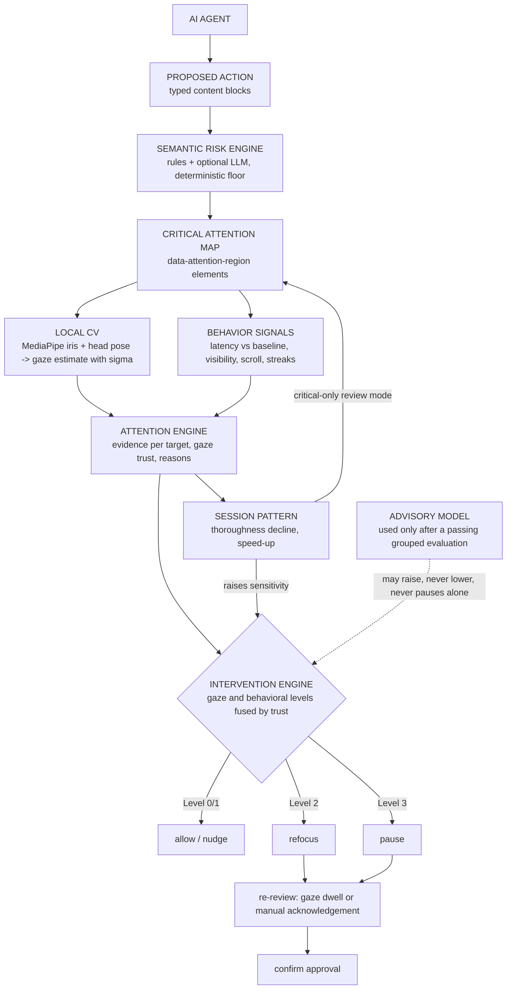
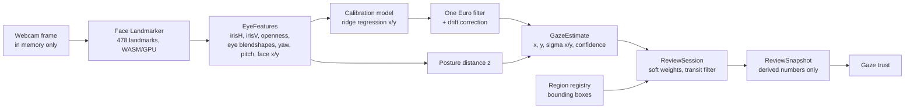
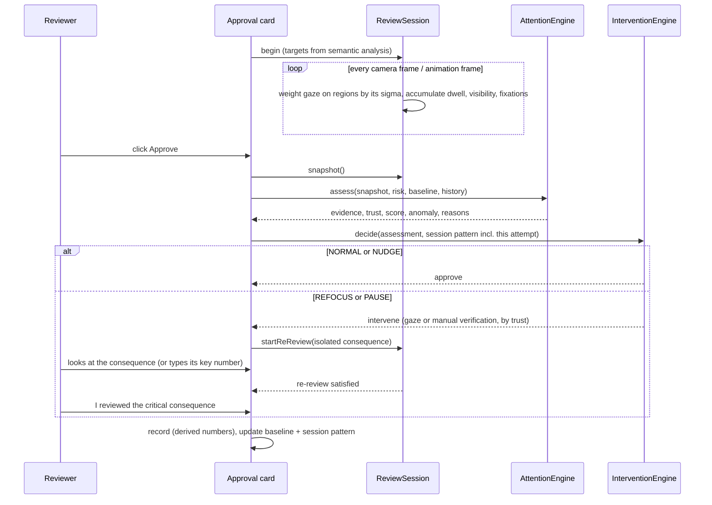
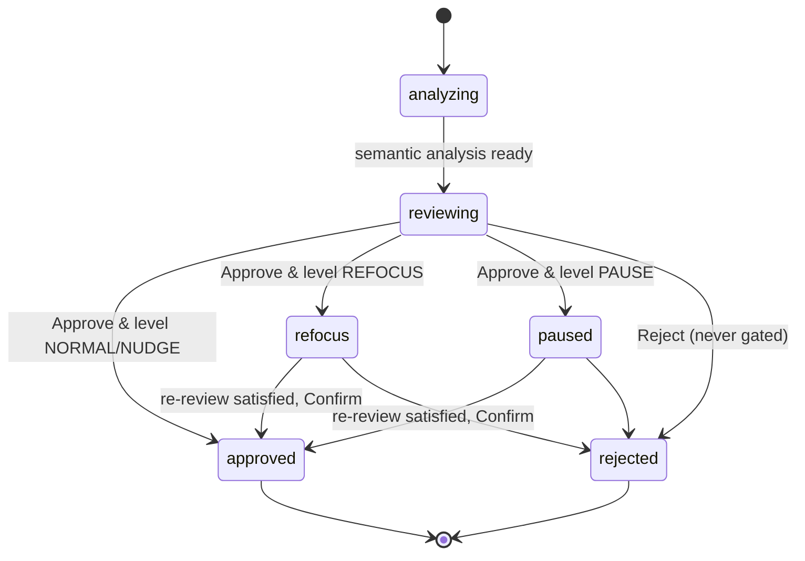

# Architecture

OverSight is a single Next.js application. Everything that touches the camera runs in the browser; the only server code is a text-only semantic analysis endpoint. The design goal: **AI decides what matters, computer vision measures where attention went (and how sure it can be), behavior adds context, and a deterministic engine decides whether to intervene.**

## System overview

## Layers and modules

| Layer | Module | Responsibility |
|---|---|---|
| Semantic (AI) | `lib/semantic/rules.ts` | Deterministic rules, block severity, target selection, statements |
| | `lib/semantic/analyzer.ts` | AI output schema, merge with deterministic floor, prompt |
| | `lib/semantic/ai-provider.ts` | OpenAI-compatible chat-completions call (server-side) |
| | `lib/semantic/server.ts`, `app/api/analyze/route.ts` | Rules always; AI when configured; fallback on error |
| | `lib/semantic/parser.ts` | Free text -> typed blocks for custom requests |
| Computer vision | `lib/cv/camera-engine.ts` | `getUserMedia`, MediaPipe Face Landmarker, frame loop with adaptive stride |
| | `lib/cv/features.ts`, `lib/cv/head-pose.ts` | Landmarks -> iris ratios, eyelid aperture, eye blendshapes, yaw/pitch |
| | `lib/cv/calibration.ts` | Ridge regression with coefficient floors, head sweep, held-out validation, posture model, quality |
| | `lib/cv/uncertainty.ts` | Per-frame gaze estimate with sigma per axis (posture, blink hold, drift) |
| | `lib/cv/drift.ts` | Drift monitor from click anchors, quick recheck |
| | `lib/cv/one-euro.ts`, `lib/cv/fixation.ts` | Smoothing, fixation detection |
| | `lib/cv/gaze-hub.ts` | Single gaze source (camera or labeled simulation), calibration persistence, staleness, effective fps |
| | `lib/cv/perf.ts` | Inference stride policy, incremental heatmap plan |
| Attention | `lib/attention/registry.ts`, `lib/attention/geometry.ts` | DOM elements of semantic regions; the geometry source the tracker measures against |
| | `lib/attention/regions.ts` | Soft weights, separability in sigma units, evidence strength |
| | `lib/attention/tracker.ts` | Per-request measurement: weighted dwell, visibility, sweep, fixations, transit filter, separation |
| | `lib/attention/trust.ts` | Gaze trust (high / medium / low / none) for one review |
| | `lib/attention/engine.ts` | Deterministic attention score, thoroughness, reasons |
| | `lib/attention/baseline.ts` | Personal review pace (overhead + per word) and dwell |
| | `lib/attention/temporal.ts`, `lib/attention/pattern.ts` | Temporal features, session pattern ("approval fatigue", behavioral) |
| | `lib/attention/rereview.ts` | Re-review validation and manual acknowledgement |
| | `lib/attention/banner.ts` | Which signal status line to show |
| Decision | `lib/risk/intervention.ts` | Four-level thresholds, trust fusion, sensitivity, bounded ML influence |
| ML | `lib/ml/features.ts`, `lib/ml/logistic.ts` | Feature vector (schema 2), IRLS logistic regression, Platt calibration, activation gate |
| | `lib/ml/dataset.ts`, `lib/ml/protocol.ts` | Study dataset v2, counterbalanced protocol, participant codes |
| | `lib/ml/evaluate.ts`, `lib/ml/replay.ts`, `lib/ml/advisory.ts` | Grouped evaluation, policy replay, pre-registered decision, training |
| State | `lib/store/*.ts` | Zustand stores: session state machine, CV status, live metrics, UI prefs |

## Gaze pipeline

- Frames are processed with `requestVideoFrameCallback`: one inference per camera frame, or every 2nd / 3rd frame when inference averages above 28 / 55 ms (`lib/cv/perf.ts`). The frame itself never leaves the landmarker call. Trust sees the effective rate: frames that actually carried eye features, per second.
- Blink frames hold the last estimate for up to 350 ms (with sigma x 1.3) rather than producing a spurious jump.
- If more than one face is present in more than 20% of frames, gaze evidence is marked unreliable for that review.
- **Soft hits instead of a hit box.** Each visible region gets a weight `exp(-d^2 / 2)` for the elliptical distance d, in sigma units, from the estimate to the region (1 inside, 0.61 at one sigma, 0.14 at two). Dwell accumulates `time x weight`. Estimates moving faster than 1500 px/s (smoothed) are in transit between fixations and add nothing.
- **Separability.** For each critical target the tracker measures the gap to the title, the summary and the decision buttons in sigma units. Below 2 sigma gaze cannot tell them apart: that target is *inconclusive* and is not judged by gaze at all.
- Region outlines in the overlay use `clamp(0.6 x sigma, 16, 72) px`; this margin is for display only.
- Regions are registered per request (`scope` = request id) and measurement starts only once that request's own card is mounted, so the outgoing card's identically named blocks can never count toward the next review. Region geometry is re-read at most every 100 ms, and at once after a scroll or resize.
- Dwell starts counting 500 ms after a request appears (where the eyes happened to rest is not inspection), and geometry/visibility also update from camera frames if animation frames are throttled.

## Uncertainty pipeline

1. **Calibration (about 35 s, `lib/cv/calibration.ts`).** A: 9 grid points, head still. A2: head sweep, eyes on 3 dots while the head turns and nods, so head movement is not mistaken for eye movement. B: 5 held-out points never used for fitting. C (optional, only if one area is much worse): 2 extra training points near it and 3 new check points. The model is ridge regression per axis with minimum coefficient floors; its reported accuracy is the held-out error (median, P90, worst point, jitter), and its sigma per axis comes from the held-out residuals. Quality (good / fair / poor) is judged on the held-out error. A posture model (median and 1.4826 x MAD of yaw, pitch, face position and face scale) records the posture the calibration was trained on.
2. **Per frame (`lib/cv/uncertainty.ts`).** `sigma = base sigma x (1 + 0.5 x max(0, z - 1.5)) x 1.3 while held x 1.5 while drift is suspected`, where z is the robust posture distance. Confidence is base / inflated sigma, 0 without exactly one face.
3. **Drift (`lib/cv/drift.ts`).** Clicks on marked controls are anchors: people look at what they click. An EWMA of anchor residuals (in sigma units) above 2 after at least 3 anchors flags possible drift: sigma is inflated and trust capped at medium until a quick recheck (3 dots, about 5 s) measures and removes the offset, or a recalibration.
4. **Staleness.** Moving, resizing or zooming the window after calibration invalidates it: trust is none until you recalibrate.
5. **Evidence per target.** strong (coverage >= 0.6 and a fixation), partial (>= 0.25), not observed, inconclusive (not separable), not visible. "Not observed" is a statement about the evidence, not about the reviewer.

## Gaze trust

`lib/attention/trust.ts` rates each review's gaze evidence:

| Trust | When |
|---|---|
| none | camera off, not calibrated, too few frames, multiple faces, face lost, sparse gaze, stale calibration |
| low | poor calibration; effective gaze rate below 5 fps; every visible critical target closer than 2 sigma to the title or summary; face tracking continuity below 0.3 |
| medium | fair or legacy calibration; 5 to 10 fps; tracking continuity below 0.55; drift suspected; head outside the calibrated posture in more than 30% of frames |
| high | everything else |

## Fusion

The engine computes a gaze level (from critical coverage, when gaze is usable) and a behavioral level (from latency, visibility, interaction and the session pattern) at the same risk. Trust decides how they combine (`decideIntervention` in `lib/risk/intervention.ts`):

| Trust | Intervention level | Re-review verified by |
|---|---|---|
| high | gaze level | gaze |
| medium | max(min(gaze level, REFOCUS), behavioral level) | gaze |
| low / none | behavioral level | manual acknowledgement |

- Below high trust, gaze may ask for a refocus but never produces a pause on its own, and the behavioral level is a floor: uncertainty changes the form of an intervention, it never turns a required one into NORMAL.
- Any HIGH or CRITICAL target that never reached the screen needs at least a REFOCUS.
- An advisory model, if one ever passes its grouped evaluation, may raise sensitivity and, below high trust on a MEDIUM+ request, turn NORMAL / NUDGE into a REFOCUS with manual verification. It never lowers a level and never produces a PAUSE the rules did not already require.
- Reject is never gated. Camera-free review ("Continue without camera") runs the behavioral path end to end.

## An approval attempt

## Approval state machine

## Scoring details

**Required dwell** per target: `words x msPerWord`, clamped to 0.6 to 2.4 s. `msPerWord` is 90 ms by default and becomes 60% of the reviewer's own attentive dwell once a baseline exists (clamped 50 to 160 ms). Personal dwell is learned only from conclusive targets.

**Expected review time**: a fixed overhead of 1.2 s (orienting, reaching for the button) plus decision-relevant words (title + summary + targets) x personal ms-per-word (default 150 ms, clamped 50 to 400 ms), clamped to 1.5 to 20 s. The baseline comes from up to 5 attentive approvals (thoroughness >= 0.6, no intervention). A latency below 45% of the expected time is a *rapid* approval.

**Behavioral anomaly** (0 to 1): 55% how far latency is below 60% of expected, 30% rapid-approval streak (current included), 15% accelerating latency trend.

**Session pattern**: computed on thoroughness (the attention score without its pattern component, so the pattern never feeds on itself). The non-increasing run of thoroughness (5-point tolerance) ending at the latest approval, measured from its peak. Detected when at least 5 approvals exist and (a) the run spans >= 4 approvals with a drop >= 0.30, or (b) >= 3 consecutive rapid approvals with a low latest score, or (c) the combined pattern strength >= 0.65, or (d) a one-sided CUSUM of the speed-up (-log latency ratio, slack 0.3) exceeds 1.5. Two attentive approvals in a row clear it. Sensitivity multiplier: `1 + 0.35 x strength + 0.08 x (streak - 1)` plus the ML gain of an activated model, capped at 1.5.

**Trust confidence** (0 to 1): calibration quality weight x tracking continuity (face-present ratio x (1 - multi-face ratio) x sqrt(facing ratio)) x frame-rate factor (effective fps / 15, capped at 1) x mean estimate confidence. Camera-free reviews have no gaze trust; their evidence confidence is fixed at 0.35.

## Semantic analysis details

- Blocks: `title`, `summary`, `reasoning`, `resource`, `change`, `consequence`, `detail`, `metadata`. Title, summary and metadata can raise overall risk but are never attention targets (everyone reads the title; the point is the buried consequence).
- Each block collects rule hits; one hit per category, highest severity wins.
- Targets: blocks at the maximum severity, one per category (in rule priority order), preferring `consequence` over `change` for the same risk, at most two (one for routine requests). Everything else at MEDIUM+ is listed as "other flagged items" but not enforced.
- Statements are generated from templates where a rule knows the shape of the consequence ("{count} {noun} will be permanently deleted.", "{service} port {port} will be reachable from the public internet.", "{amount} will be sent to a bank account that was changed {when} and has not been verified.").

## Advisory model (layer 2)

- 22 derived features, schema 2 (`lib/ml/features.ts`): 14 about the current review (conclusive coverage, trust level and confidence, separation, time to first critical fixation, attributed fixations, latency, visibility, off-card share, pointer, hover, scroll, risk) and 8 temporal ones (latency median, EWMA and slope, rapid streak, coverage mean, targets not observed, speed-up CUSUM, approval index). The deterministic score itself is excluded.
- Evaluation before use (`docs/EVALUATION.md`): leave-one-participant-out, Platt calibration fitted inside each fold, PR-AUC, ROC-AUC, Brier score, reliability, and a replay of the intervention policy with and without the model (false intervention rate, missed detections). A pre-registered rule decides.
- Activation: a model is used only if its metadata records a passing grouped evaluation for the current feature schema and policy version. Row-level cross-validation, however good, never activates a model. No model is trained or shipped with OverSight: there is no real study data yet.
- Influence: bounded, as described under Fusion.

## Key decisions

| Decision | Why |
|---|---|
| Browser-side CV, no Python backend | Privacy (frames never leave the tab) and lower latency; the CSP enforces it |
| Deterministic engine decides, ML advises | No labeled eye-tracking dataset exists for this task; demo reliability and explainability come first |
| Regions from the DOM, not OCR | The app renders the text, so it knows exactly where the critical sentence is |
| Per-frame uncertainty instead of fixed margins | Webcam gaze error varies with calibration, posture and time; evidence is weighted by what the signal supports |
| Trust-gated fusion | Uncertain gaze should change the form of an intervention (manual confirmation), never remove one |
| Accuracy measured on held-out points | Training-point error flatters the model; the held-out error is what the reviewer gets |
| Grouped evaluation before any model is used | Row-level splits leak a participant's habits into the test set |
| Personal baseline instead of fixed timers | People read at different speeds; "wait 5 seconds" measures time, not attention |
| Few targets per request | Asking users to inspect everything recreates warning fatigue |
| Buttons in the card header | Keeps the approve path away from buried consequences, so "looked at the title and clicked" is distinguishable from "read the warning" |
